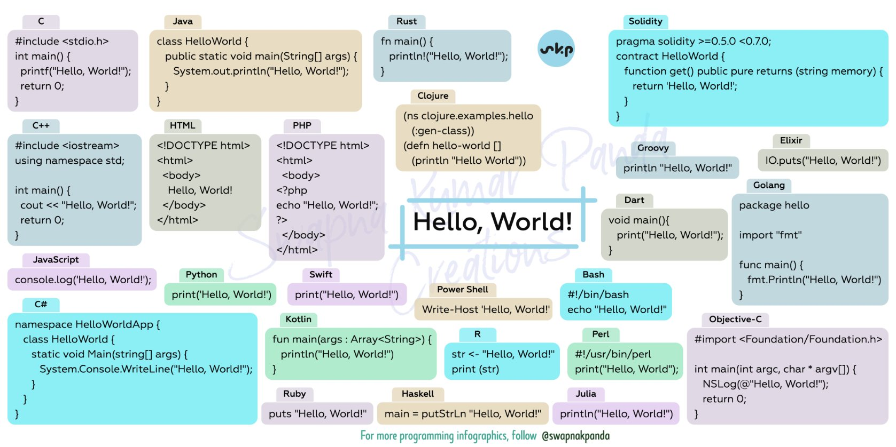

# Introduction to Python

### What is Python Programming

Python is a high-level, interpreted, interactive and object-oriented scripting language. Python is designed to be highly readable. It uses English keywords frequently whereas the other languages use punctuations. It has fewer syntactical constructions than other languages.


**Good to know:**&#x20;

Python is a popular programming language. It was created by Guido van Rossum, and released in 1991.


### Features of Python

Python's features include-

* **Easy-to-learn:** Python has few keywords, a simple structure, and a clearly defined syntax. This allows a student to pick up the language quickly.
* **Easy-to-read:** Python code is more clearly defined and visible to the eyes.
* **Easy-to-maintain:** Python's source code is fairly easy-to-maintain.
* **A broad standard library:** Python's bulk of the library is very portable and cross-platform compatible on UNIX, Windows, and Macintosh.
* **Interactive Mode:** Python has support for an interactive mode, which allows interactive testing and debugging of snippets of code.
* &#x20;**Portable:** Python can run on a wide variety of hardware platforms and has the same interface on all platforms.
* **Extendable:** You can add low-level modules to the Python interpreter. These modules enable programmers to add to or customize their tools to be more efficient.&#x20;
* **Databases:** Python provides interfaces to all major commercial databases.

### What can Python do?

* Python can be used on a server to create web applications.
* Python can be used alongside software to create workflows.
* Python can connect to database systems. It can also read and modify files.
* Python can be used to handle big data and perform complex mathematics.
* Python can be used for rapid prototyping, or for production-ready software development.

## Applications for Python

#### Web Applications

We can use Python to develop web applications. It provides libraries to handle internet protocols such as HTML and XML, JSON, Email processing, request, beautifulSoup, Feedparser, etc. One of the Python web-framework named Django is used on **Instagram**. Python provides many useful frameworks, and these are given below:

* Django and Pyramid framework(Use for heavy applications)
* Flask and Bottle (Micro-framework)
* Plone and Django CMS (Advance Content management)

#### Desktop GUI Applications

The GUI stands for the Graphical User Interface, which provides a smooth interaction to any application. Python provides a **Tk GUI library** to develop a user interface. Some popular GUI libraries are given below.

* Tkinter or Tk
* wxWidgetM
* Kivy (used for writing multitouch applications )
* PyQt or Pyside

#### Console-based Application

Console-based applications run from the command-line or shell. These applications are computer programs that use commands to execute. This kind of application was more popular in the old generation of computers. Python can develop this kind of application very effectively. It is famous for having REPL, which means **the Read-Eval-Print Loop** that makes it the most suitable language for command-line applications.

Python provides many free library or module which helps to build command-line apps. The necessary **IO** libraries are used to read and write. It helps to parse arguments and create console help text out-of-the-box. There are also advanced libraries that can develop independent console apps.

#### Software Development

Python is useful for the software development process. It works as a support language and can be used to build control and management, testing, etc.

* **SCons** is used to build control.
* **Buildbot** and **Apache** Gumps are used for automated continuous compilation and testing.
* **Round** or **Trac** for bug tracking and project management.

#### Scientific and Numeric&#x20;

This is the era of Artificial intelligence where the machine can perform the task the same as the human. Python language is the most suitable language for Artificial intelligence or machine learning. It consists of many scientific and mathematical libraries, which makes it easy to solve complex calculations.

Implementing machine learning algorithms require complex mathematical calculation. Python has many libraries for scientific and numeric such as Numpy, Pandas, Scipy, Scikit-learn, etc. If you have some basic knowledge of Python, you need to import libraries on the top of the code. A few popular frameworks of machine libraries are given below.

SciPy, Scikit-learn, NumPy, Pandas, Matplotlib

#### Business Applications

Business Applications differ from standard applications. E-commerce and ERP are an example of business applications. This kind of application requires extensively, scalability and readability, and Python provides all these features.

Oddo is an example of the all-in-one Python-based application which offers a range of business applications. Python provides a **Tryton** platform which is used to develop the business application.

**Audio or Video-based Applications**

Python is flexible to perform multiple tasks and can be used to create multimedia applications. Some multimedia applications which are made by using Python are **TimPlayer, cplay,** etc. A few multimedia libraries are given below.

* Gstreamer
* Pyglet
* QT Phonon

#### 3D CAD Applications

The CAD (Computer-aided design) is used to design engineering related architecture. It is used to develop the 3D representation of a part of a system. Python can create a 3D CAD application by using the following functionalities.

* Fandango (Popular )
* CAMVOX
* HeeksCNC
* AnyCAD
* RCAM

#### Enterprise Applications

Python can be used to create applications that can be used within an Enterprise or an Organization. Some real-time applications are OpenERP, Tryton, Picalo, etc.

#### Image Processing Application

Python contains many libraries that are used to work with the image. The image can be manipulated according to our requirements. Some libraries of image processing are given below.

* OpenCV
* Pillow
* SimpleITK

### Python Syntax compared to other programming languages

* Python was designed for readability and has some similarities to the English language with influence from mathematics.
* Python uses new lines to complete a command, as opposed to other programming languages which often use semicolons or parentheses.
* Python relies on indentation, using whitespace, to define scope; such as the scope of loops, functions and classes. Other programming languages often use curly brackets for this purpose

Here are a couple of examples of python syntax compared to other popular programming languages:

